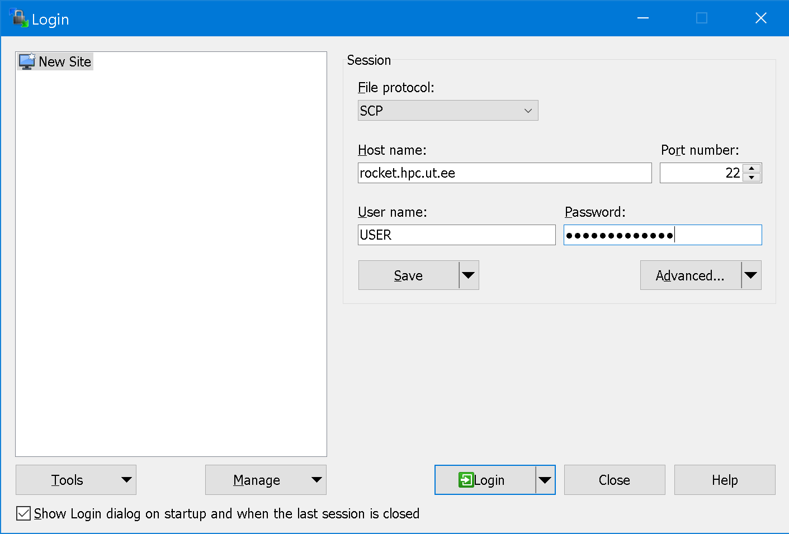
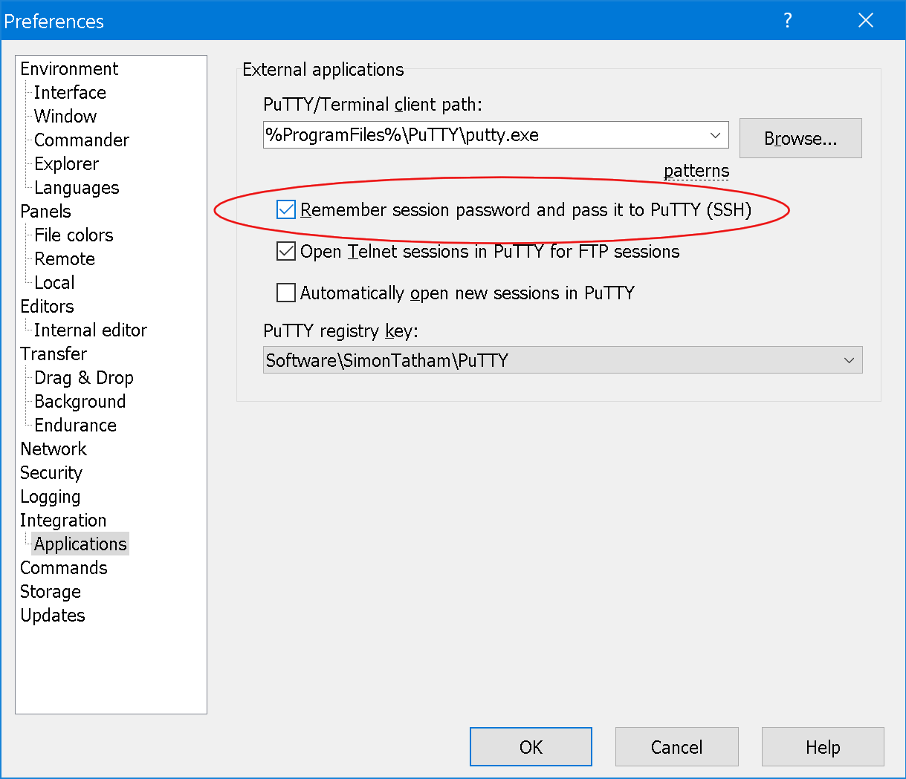
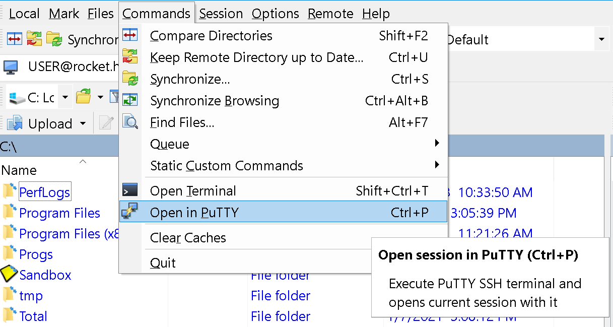

# 0. Prerequisites

For Windows users, we suggest to use [WinSCP](https://winscp.net/eng/downloads.php) for file transfer and [PuTTY](https://winscp.net/eng/downloads.php#putty) for starting a command line session on a high-performance computing (HPC) cluster.

Alternatively, on Windows 10 one may try to use WSL - Windows Subsystem for Linux (see installation guide [here](https://docs.microsoft.com/en-us/windows/wsl/install-win10)).

For Linux and Mac users, it would be possible to use a terminal emulator.

We'll run analysis on the [Rocket Cluster](https://hpc.ut.ee/en/resources/rocket-cluster-en/) of the University of Tartu.

## Windows users, WinSCP setup

- To connect to the server, add your user and password as shown on the image:
<br/>
File protocol: SCP<br/>
Host name: `rocket.hpc.ut.ee`<br/>
User name: substitute `USER` with your login

- To setup automatic transmission of WinSCP passwords to PuTTY (SSH), go to Menu `Options` -> `Preferences` -> `Applications`
Set the tickmark on `Remeber session password and pass it to PuTTY (SSH)`


- To start a command line session on HPC, press `Ctrl + P` or go to menu `Commands` -> `Open in PuTTY`


## For Linux and Mac users

To connect to to the HPC just run:
```bash
ssh USER@rocket.hpc.ut.ee
```
(substitute `USER` with your login).

# 1. Setup working environment on HPC

To install [Miniconda](https://docs.conda.io/en/latest/index.html) run the following code:
```bash
wget https://repo.anaconda.com/miniconda/Miniconda3-latest-Linux-x86_64.sh -O ~/miniconda.sh
bash ~/miniconda.sh -b -p $HOME/miniconda
~/miniconda/bin/conda init bash
source ~/.bashrc
```


On the cluster we will use:
- [MAFFT](https://mafft.cbrc.jp/alignment/software/) for alignment
- [RAxML-NG](https://github.com/amkozlov/raxml-ng) and [MrBayes](https://nbisweden.github.io/MrBayes/download.html) for phylogenetic tree inference.<br/>
To install the software run:
```bash
conda install -c bioconda -c conda-forge raxml-ng mrbayes mafft
```


If the software you whish to use could not be installed to the base (default) environment due to the conflict of versions, or you want to use a specific version of the program, or just want to keep it separate, you may create a separate envrionment with:
```bash
conda create --name MYENV -c bioconda raxml-ng=0.9.0
conda activate MYENV
raxml-ng --version
```

