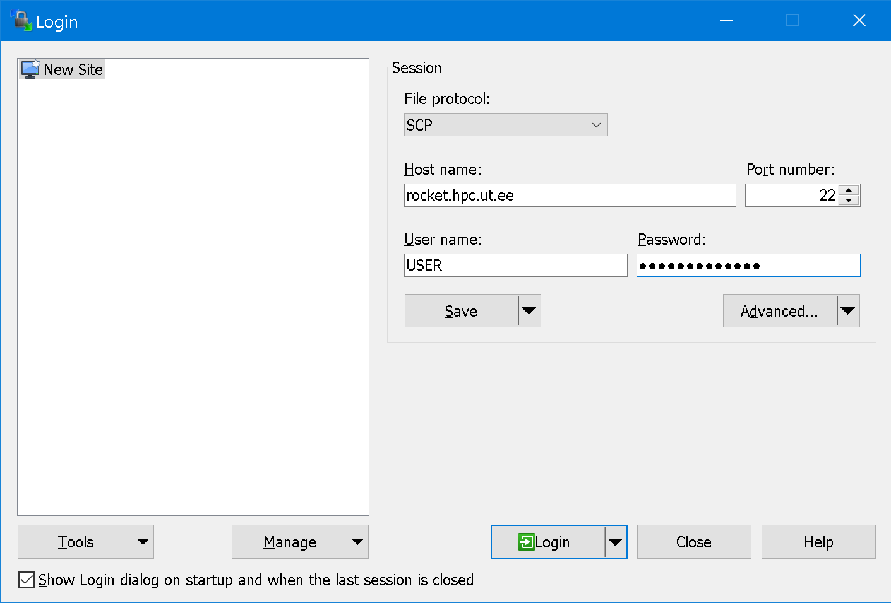
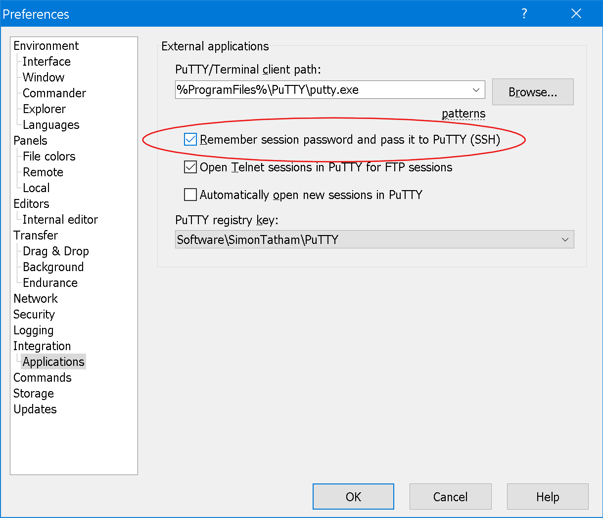
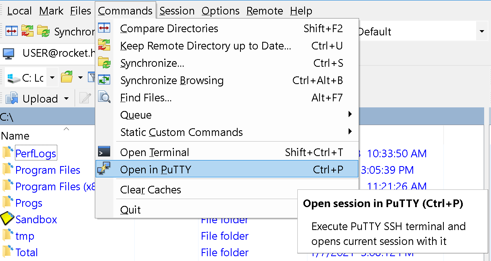

# 0. Prerequisites

For Windows users, we suggest to use [WinSCP](https://winscp.net/eng/downloads.php) for file transfer and [PuTTY](https://winscp.net/eng/downloads.php#putty) for starting a command line session on a high-performance computing (HPC) cluster.

Alternatively, on Windows 10 one may try to use WSL - Windows Subsystem for Linux (see installation guide [here](https://docs.microsoft.com/en-us/windows/wsl/install-win10)).

For Linux and Mac users, it would be possible to use a terminal emulator.

We'll run analysis on the [Rocket Cluster](https://hpc.ut.ee/en/resources/rocket-cluster-en/) of the University of Tartu.

## Windows users, WinSCP setup

- To connect to the server, add your user and password as shown on the image:
<br/>
File protocol: SCP<br/>
Host name: `rocket.hpc.ut.ee`<br/>
User name: substitute `USER` with your login

- To setup automatic transmission of WinSCP passwords to PuTTY (SSH), go to Menu `Options` -> `Preferences` -> `Applications`
Set the tickmark on `Remeber session password and pass it to PuTTY (SSH)`


- To start a command line session on HPC cluster, press `Ctrl + P` or go to menu `Commands` -> `Open in PuTTY`


## For Linux and Mac users

To connect to to the HPC cluster just run:
```bash
ssh USER@rocket.hpc.ut.ee
```
(substitute `USER` with your login).

To copy a file or multiple files **to HPC cluster** use:
```bash
scp yourfile amiri@rocket.hpc.ut.ee:~/yourfile   # single file
scp file1 file2 amiri@rocket.hpc.ut.ee:~/        # multiple files
```
To copy file **from HPC cluster** (e.g., `yourfile` from home directory on HPC to home directory on your computer) use:
```bash
scp USER@rocket.hpc.ut.ee:~/yourfile ~/yourfile
```

If you have large files (or large number of files), it's better to use [`rsync`](https://en.wikipedia.org/wiki/Rsync) program for file transfer, e.g.
```bash
rsync -avz Documents/* user@rocket.hpc.ut.ee:~/all/
```


# 1. Setup working environment on HPC cluster

## Conda

On the HPC systems and clusters, users can install software into their home directory where they have write permissions. To make the life easier, you may use `Conda` - a package manager, which helps you find and install the software and its dependencies.<br/>
To install [Miniconda](https://docs.conda.io/en/latest/index.html) run the following code:
```bash
wget https://repo.anaconda.com/miniconda/Miniconda3-latest-Linux-x86_64.sh -O ~/miniconda.sh
bash ~/miniconda.sh -b -p $HOME/miniconda
~/miniconda/bin/conda init bash
source ~/.bashrc
conda update --all --yes -c bioconda -c conda-forge
conda install --yes -c conda-forge mamba
```

For phylogenetic tree inference, we will use the following programs on the cluster:
- [RAxML-NG](https://github.com/amkozlov/raxml-ng), for maximum likelihood-based inference
- [MrBayes](https://nbisweden.github.io/MrBayes/download.html), for Bayesian inference.

To install the software run<sup>\*</sup>:
```bash
conda install -c bioconda -c conda-forge raxml-ng mrbayes
```

**<sup>\*</sup>** Probably this step will not work on Rocket Cluster due to the conflict of versions. To overcome this issue, we will create a separate environment with `conda`.

## Conda environments

If the software you whish to use could not be installed to the base (default) environment due to the conflict of versions, or you want to use a specific version of the program, or just want to keep it separate, you may create a separate envrionment with:
```bash
mamba create --name PHYLO -c bioconda -c conda-forge mrbayes=3.2.6 raxml-ng
conda activate PHYLO           # swith to the new environment we've created
```

Verify which software version are installed:
```bash
raxml-ng --version
mb about
```

To swith to the base environment run:
```bash
conda deactivate
```

## Module system

Alternatively, if the software you whish to use is pre-installed on the HPC cluster, you may load it as an environment module.<br/>
To list all available modules, use `module avail` command (scroll the list with `space` button, press `q` to quit).<br/>
To search for a particular module, use e.g. `module -r spider '.*mrbayes.*'`.<br/>
If the required software was found, you need to load the module, e.g.:
```
module load mrbayes/3.2.7a
mb about   # verify if MrBayes is available
```

<br/><br/>
If you've set up the access to the HPC cluster and installed the software you need, you may proceed to the next part:<br/>
[2. Scheduling jobs on HPC](01.SLURM.md)
