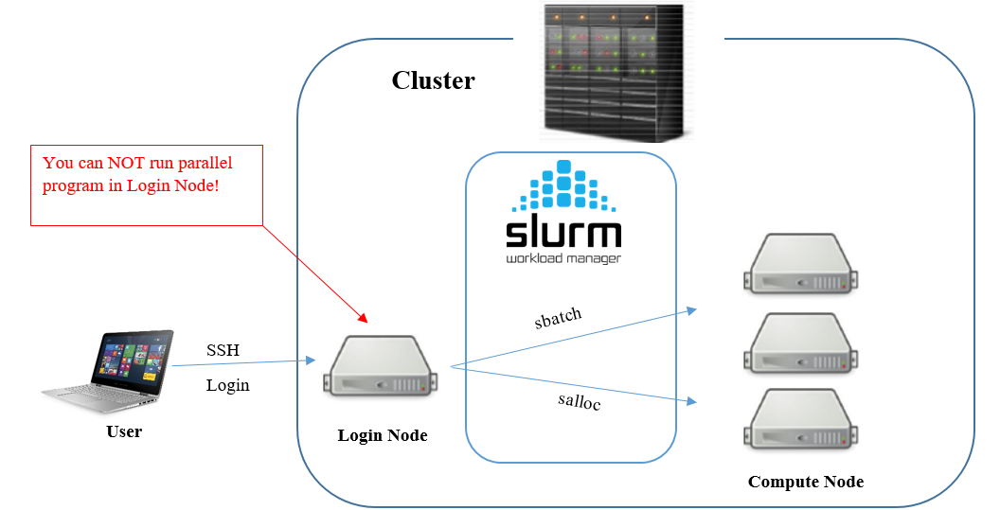

# 2. Scheduling jobs on HPC

## Slurm, the workload manager

The Slurm Workload Manager, a.k.a. Simple Linux Utility for Resource Management (SLURM), is used to share the HPC resources between users.

Please note, that users login from their computers to the cluster **head node**.<br/>
**Do not run the analysis on the head node!**<br/>
You should use it only to schedule the tasks that would be distributed on the **cluster nodes**.

<br/>
<sub><sup>Image source: [https://pdc-support.github.io/hpc-intro/09-scheduling/](https://pdc-support.github.io/hpc-intro/09-scheduling/)</sup></sub>


To run the program on HPC you should:
- Prepare a batch script with directives to SLURM about the number of CPUs, amount of RAM, and time duration requested for the job, along with commands which perform the desired calculations;<br/>
- Submit the script to the batch queue. SLURM will evaluate the task's priority and start executing the job when it reaches the front of the queue.<br/>
When the job will finish, you may retrieve the output files.

## Scheduling the job

### Batch script

Here is an basic batch script which contains a minimal number of SLURM options:
```
#!/bin/bash -l
#SBATCH --job-name=my_job
#SBATCH --cpus-per-task=4
#SBATCH --nodes=1
#SBATCH --mem=10G
#SBATCH --time=48:00:00

## If needed, you may load the required modules here
# module load X

## Run your code
some_program -i input.data -o output_1.data --threads 4
some_script.sh output_1.data > output_2.data
echo "Done" > output.log
```

The syntax for the SLURM directive in a script is `#SBATCH <flag>`, where `<flag>` could be:<br/>
- `--job-name`, the name of the job;
- `--cpus-per-task`, the number of CPUs each task should have (e.g., 4 cores);
- `--nodes`, requested number of nodes (each node could have multiple CPUs);
- `--mem`, requested amount of RAM (e.g., 10 gigabytes);
- `--time`, the requested time for job (e.g., 48 hours).

To submit a job, save the code above to a file (e.g. `my_job.sh`) and run:
```
sbatch my_job.sh
```

### Scheduling a task directly from command line

If the command you wish to run is rather simple, you may run it without a batch script, but in that case you should provide SLURM directives as arguments to `sbatch` command:
```
sbatch \
  --job-name=my_job \
  --ntasks-per-node=4 --nodes=1 --mem=10G \
  --time=48:00:00 \
  some_script.sh input.data
```


## Job management

When the job is submitted, you may monitor the queue and see the status of your running tasks:
```
squeue -u $USER
```
The most common job state codes (column `ST`) are:<br/>
`PD` =   PENDING<br/>
`R`  =   RUNNING<br/>
`S`  =   SUSPENDED<br/>

To cancel the job use:
```
scancel <JOBID>                   # one job by ID (e.g., where <JOBID> is 18060866 - see column JOBID in "squeue" output)
scancel --name myJobName          # one or more jobs by name
scancel -u $USER                  # all jobs for a current user
```

To inspect the resources consumed by job on HPC run:
```
sacct -u $USER --starttime 2021-06-10 --delimiter "\t" --format="Elapsed,MaxRSS,NodeList"
```
Next time when you will start a new job, you may adjust the values of the required time and amount of RAM based on the resources required for a previous task.

Are you ready to rumble? Let's move on and build our own tree!<br/>
**[3. Phylogenetic tree building](02.Phylo_on_HPC.md)**
